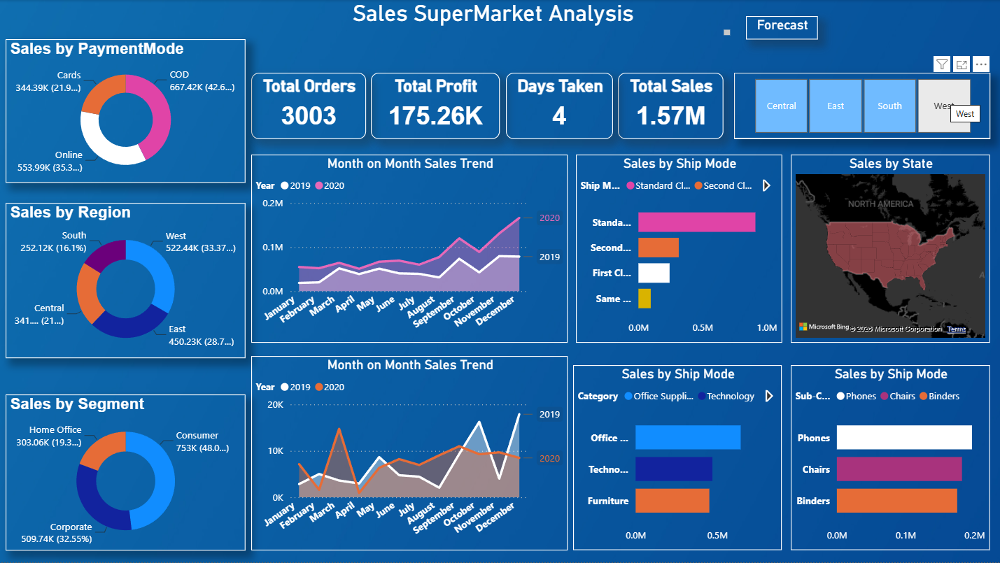

# 📊 Sales SuperMarket Analysis Dashboard | Power BI


---

# 📌 Project Overview

This project presents an interactive **Sales SuperMarket Analysis Dashboard** developed using **Microsoft Power BI**. The dashboard provides a comprehensive view of supermarket sales performance through interactive visualizations, KPI tracking, regional analysis, customer segmentation, and time-series forecasting.

The objective of the dashboard is to transform raw retail sales data into meaningful business insights that support data-driven decision-making.

---

# 🎯 Project Objective

The primary objective of this project is to contribute to business success by utilizing **data analysis techniques**, specifically **time-series analysis**, to deliver valuable insights and accurate **15-day sales forecasting**.

The dashboard focuses on four major areas:

- 📊 Dashboard Creation
- 📈 Data Analysis
- 🔮 Sales Forecasting
- 💡 Actionable Business Recommendations

---

# ✨ Dashboard Highlights

- Executive KPI Dashboard
- Interactive Dashboard Navigation
- Dynamic Filters & Slicers
- Regional Sales Analysis
- Customer Segment Analysis
- Payment Mode Analysis
- Shipping Mode Analysis
- Category & Sub-Category Analysis
- Monthly Sales Trend
- Monthly Profit Trend
- State-wise Sales Analysis
- 15-Day Sales Forecast

---

# 🛠 Tools & Technologies

- Microsoft Power BI Desktop
- Power Query
- DAX (Data Analysis Expressions)
- Data Modeling
- Time-Series Forecasting
- Interactive Dashboard Design

---

# 📷 Dashboard Preview

## 📌 Overview Dashboard


---

## 📌 Sales Forecast Dashboard



---

# 📊 Key Performance Indicators (KPIs)

| KPI | Value |
|------|-------|
| 💰 Total Sales | **1.57M** |
| 💵 Total Profit | **175.26K** |
| 📦 Total Quantity | **22K** |
| 🚚 Average Delivery Time | **4 Days** |

---

# 📈 Dashboard Features

## Executive KPI Dashboard

- Total Sales
- Total Profit
- Total Quantity
- Average Delivery Time

## Sales Analysis

- Sales by Payment Mode
- Sales by Region
- Sales by Customer Segment
- Monthly Sales Trend
- Monthly Profit Trend
- Sales by Ship Mode
- Sales by Category
- Sales by Sub-Category
- State-wise Sales Analysis

## Forecast Dashboard

- Historical Daily Sales
- 15-Day Sales Forecast
- Forecast Confidence Interval
- State-wise Sales Distribution

---

# 💡 Business Insights

## 📌 Overall Business Performance

- Generated **1.57 Million** in total sales.
- Earned **175.26K** in total profit.
- Successfully sold over **22K products**.
- Maintained an average delivery time of **4 days**, demonstrating efficient logistics.

---

## 🌍 Regional Performance

- The **West Region** recorded the highest sales.
- The **East Region** emerged as the second-best performing region.
- The **Central** and **South** regions contributed comparatively lower revenue.

### Recommendation

Focus marketing campaigns and inventory expansion in underperforming regions to improve overall revenue.

---

## 👥 Customer Segment Analysis

- The **Consumer** segment contributes nearly half of total revenue.
- **Corporate** customers represent the second-largest customer group.
- **Home Office** customers contribute the smallest share of sales.

### Recommendation

Introduce loyalty programs for Consumer customers and volume discounts for Corporate clients.

---

## 💳 Payment Mode Analysis

- **Cash on Delivery (COD)** is the most preferred payment method.
- **Online Payments** contribute a significant portion of total sales.
- **Card Payments** account for the lowest sales contribution.

### Recommendation

Promote digital payment methods using cashback offers and exclusive online discounts.

---

## 📈 Monthly Sales Trend

- Sales fluctuate throughout the year.
- Significant growth is observed during the final quarter, indicating seasonal demand.

### Recommendation

Increase inventory and promotional activities before peak shopping seasons.

---

## 💹 Monthly Profit Trend

- Profit follows a trend similar to sales.
- Higher profitability is observed during the final months of the year.

### Recommendation

Focus promotional campaigns on high-margin products during peak periods.

---

## 🚚 Shipping Mode Analysis

- **Standard Class** is the most frequently used shipping method.
- **Second Class** is the second preferred option.
- **Same Day** shipping has the lowest usage.

### Recommendation

Encourage premium shipping adoption through promotional pricing.

---

## 🛍 Category Performance

- **Office Supplies** generated the highest sales.
- **Technology** ranked second.
- **Furniture** contributed the lowest revenue among the three categories.

### Recommendation

Increase promotional efforts for Furniture products while maintaining inventory for high-performing categories.

---

## 📱 Top Performing Sub-Categories

- **Phones** generated the highest sales.
- **Chairs** and **Binders** are among the strongest contributors.

### Recommendation

Maintain adequate stock levels for high-demand products and introduce bundle offers to increase average order value.

---

## 📍 State-wise Analysis

- **California** recorded the highest sales.
- Sales are concentrated in a few major states, indicating potential growth opportunities elsewhere.

### Recommendation

Launch region-specific marketing campaigns to improve sales in underperforming states.

---

# 🔮 Sales Forecasting

The Forecast Dashboard utilizes **Power BI's built-in Time-Series Forecasting** capability to predict sales for the next **15 days** based on historical daily sales data.

### Forecast Includes

- Historical Sales Trend
- Forecasted Sales
- Confidence Interval
- Daily Sales Projection

### Business Value

- Inventory Planning
- Demand Forecasting
- Revenue Estimation
- Business Decision Support

---

# 📂 Repository Structure

```text
PowerBI-Sales-SuperMarket-Analysis/
│
├── Images/
│   ├── Overview_Dashboard.png
│   └── Forecast_Dashboard.png
│
├── Dataset/
│   └── SuperStore.csv
│
├── Documentation/
│   ├── Business_Insights.md
│   └── Forecast_Methodology.md
│
├── README.md
├── LICENSE
└── .gitignore
```

---

# 🚀 Skills Demonstrated

- Power BI Dashboard Development
- Business Intelligence
- Data Visualization
- KPI Dashboard Design
- DAX Calculations
- Power Query
- Data Modeling
- Time-Series Forecasting
- Retail Sales Analytics
- Business Analysis
- Interactive Reporting
- Decision Support Systems

---

# 🔄 Future Enhancements

- Customer Profitability Dashboard
- Product-Level Sales Forecasting
- Inventory Management Dashboard
- Target vs Actual Sales Dashboard
- Customer Churn Analysis
- Advanced DAX Measures
- Row-Level Security (RLS)
- Power BI Service Deployment
- Automated Data Refresh

---

# 📖 Dataset

The dashboard is built using a retail supermarket sales dataset containing:

- Orders
- Sales
- Profit
- Customers
- Products
- Categories
- Sub-Categories
- Regions
- States
- Shipping Information
- Payment Modes

---

# 👨‍💻 Author

**Vishnu G**

**Aspiring Data Analyst | Data Engineer | Business Intelligence Developer**

### 📬 Connect with Me

- GitHub: https://github.com/Vishnug21
- LinkedIn: https://www.linkedin.com/in/vishnugprof/

---

## ⭐ If you found this project helpful, consider giving this repository a Star!
